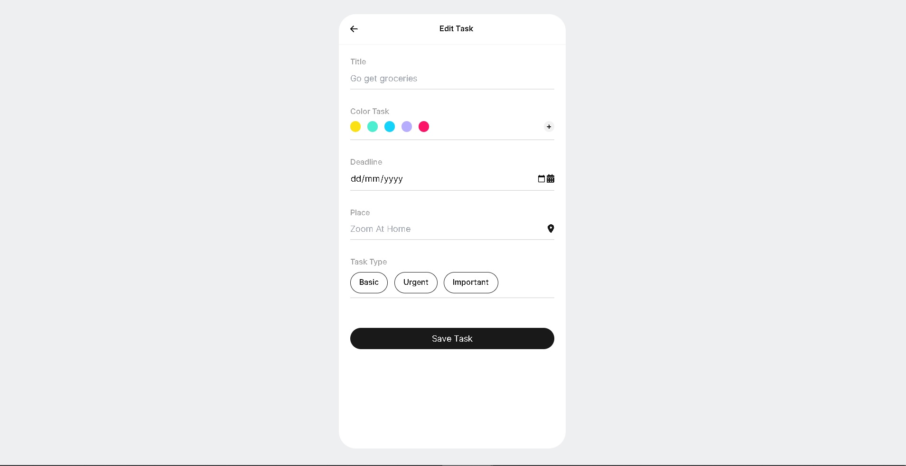
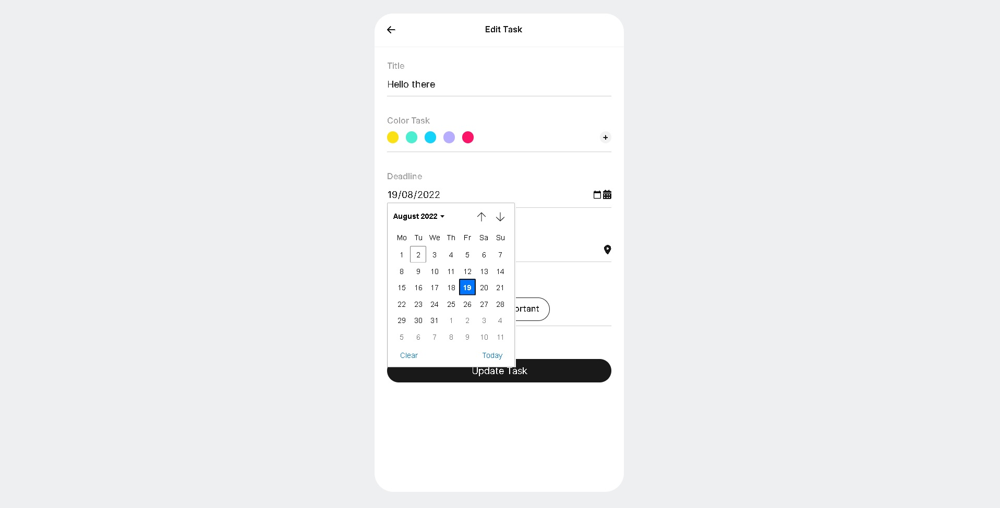

# Todo-App


> This is a simple and functional Todo App

---

### Table of Contents

<ins>Sections</ins>

- [Description](#description)
- [How To Use](#how-to-use)
- [Author Info](#author-info)

---

## Description

This is a simple Todo App designed using HTML, TailwindCss in conjunction with normal CSS. And Plain JavaScript. This Todo App uses localStorage for this purpose.

#### Technologies

- HTML
- TailwindCSS & CSS
- JavaScript
- Windows LocalStorage

[Back To The Top](#Todo-App)

---

## How To Use

#### Installation

After successfully cloning this repository, you may need to install yarn and all dependencies used for this project.
The following will prove useful

Install "yarn" Globally if you have not done so before

`npm install --global yarn`

then install the dependencies on the project using

`yarn install`

#### API References

```javaScript
const color = document.querySelector("input[name='color-selector']:checked").value;
```

[Back To The Top](#read-me-template)

---

#### Images


> This is the home page of the project showing some task



> This is the add-task page of the project



> This is the "edit-page"

[Back To The Top](#read-me-template)

---

## References

- Twitter - [@richmondelaigwu](https://twitter.com/richmondelaigwu)
- GitHub - [Richmond Elaigwu](https://github.com/Sprof22)

  [Back To The Top](#Todo-App)

---

## Author Info

- Twitter - [@richmondelaigwu](https://twitter.com/richmondelaigwu)
- GitHub - [Richmond Elaigwu](https://github.com/Sprof22)

[Back To The Top](#Todo-App)
